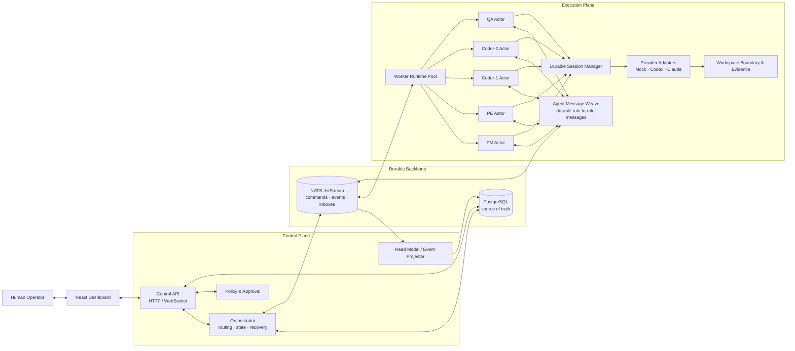

# AgentWeave

AgentWeave is an open-source **runtime OS for collaborative AI agents**. An
agent is not an isolated chat session: it is an actor inside a durable,
observable, and human-steerable system that can coordinate with other actors
and safely resume after interruption.

The runtime owns the workstream, task graph, message delivery, provider
session, workspace boundary, evidence, recovery, and approval points. Agents
are replaceable workers; the runtime is the product.

This repository is pre-1.0 and currently focused on a single-host, Docker-first
MVP for software-development workstreams. It is not production-hardened for
untrusted multi-tenant deployment.

## Research context and design thesis

AgentWeave is built around a simple thesis: **the innovation space of multiple
collaborating agents can be larger than a single Agent ↔ Human conversation**.
The important difference is not merely using more model calls. Different agents
can hold different roles, challenge assumptions, propose alternatives, divide
the search space, and combine partial solutions before a human reviews the
result.

This thesis is informed by research on multi-agent conversation, role-based
collaboration, and debate. AutoGen presents flexible applications built from
conversable agents, humans, and tools; CAMEL studies role-playing agents that
cooperate with less continuous human steering; multi-agent debate reports gains
in reasoning and factuality from independent proposals and critique; and
MetaGPT shows how role-specialized workflows can structure complex software
engineering tasks.

These works do not imply that adding agents automatically improves a system.
Naive agent chains can multiply inconsistency and hallucination. AgentWeave's
contribution is therefore the runtime around collaboration: durable messages,
explicit task ownership, observable state transitions, evidence, recovery, and
human approval.

References:

- [AutoGen: Enabling Next-Gen LLM Applications via Multi-Agent Conversation](https://arxiv.org/abs/2308.08155)
- [CAMEL: Communicative Agents for “Mind” Exploration of Large Language Model Society](https://arxiv.org/abs/2303.17760)
- [Improving Factuality and Reasoning in Language Models through Multiagent Debate](https://arxiv.org/abs/2305.14325)
- [MetaGPT: Meta Programming for A Multi-Agent Collaborative Framework](https://arxiv.org/abs/2308.00352)

The core loop is:

```text
goal → decompose → assign or parallelize → execute → communicate → review
     → attach evidence → recover or continue → request human approval
```

This makes long-running work visible: humans can see what each agent is doing,
which task is moving, what messages caused a handoff, and why the system is
waiting.

## Architecture

AgentWeave is split into three planes:



### Control Plane

The Control API is the provider-neutral coordination boundary. It exposes HTTP
and WebSocket APIs for the dashboard, owns workstream lifecycle commands,
creates and updates tasks, applies policy and approval rules, and runs the
Orchestrator state machine.

The Orchestrator handles routing, state transitions, retries, recovery, and
human escalation. It can coordinate sequential work as well as independent or
parallel tasks; a task does not have to be a strict child of another task.

### Durable Backbone

PostgreSQL is the source of truth for workstreams, agents, tasks, messages,
inboxes, sessions, leases, and evidence. NATS JetStream transports commands and
events between the Control Plane and workers with durable consumers,
acknowledgements, retries, and dead-letter handling.

The dashboard is a read-oriented operator console. Its task board, agent
execution cards, live message bus, summaries, and activity views are projected
from durable state and live events, so a refresh does not erase the history.

### Execution Plane

Workers register, send heartbeats, acquire task leases, consume agent inboxes,
run provider sessions, and publish normalized execution events. Each runtime
actor has its own role, status, current task, session, usage, and auditable
output.

The provider adapter boundary supports Mock, Codex App Server, Claude Code, and
future providers behind one contract for streaming, cancellation, resume,
failure classification, checkpoints, and usage. Workspace access is explicit
and bounded; tests, diffs, tool output, and artifacts are persisted as evidence
instead of remaining hidden in a transcript.

The complete topology is in [`architecture.mmd`](architecture.mmd).

## Runtime concepts

- **Workstream** — a durable long-running objective and its lifecycle.
- **Task** — an actionable unit with an owner, acceptance criteria,
  dependencies, relationships, status, and evidence. Tasks may be sequential,
  parallel, or independent.
- **Agent actor** — a runtime identity such as PM, PE, Coder, or QA. A role is
  an execution responsibility, not a separate product.
- **Message bus** — durable human ↔ agent and agent ↔ agent communication with
  correlation and causation IDs.
- **Session** — provider-specific state that can be leased, checkpointed,
  resumed, cancelled, and safely retried.
- **Human boundary** — explicit pause, resume, approval, rejection, and
  escalation points. Autonomy remains legible and controllable.

## Technology stack

- TypeScript monorepo managed by pnpm and Turborepo
- React 19, Mantine, and React Flow for the operator dashboard
- Fastify for the Control API
- PostgreSQL for durable state and session recovery
- NATS JetStream for commands, events, inboxes, ACKs, retries, and DLQ flows
- Docker Compose for the local runtime
- Vitest, Playwright, and TypeScript checks for validation
- Prometheus, Loki, Promtail, and Grafana for local observability

## Capability matrix

AgentWeave is a developer preview. The table below separates behavior that is
available on `main` from work that is intentionally still in progress.

| Capability                                                                           | Status        | Current boundary                                                                                     |
| ------------------------------------------------------------------------------------ | ------------- | ---------------------------------------------------------------------------------------------------- |
| Durable Workstreams, Tasks, Messages, evidence, and provider sessions in PostgreSQL  | Implemented   | Designed for the trusted, single-host Docker deployment                                              |
| Per-Workstream event sequence, reconnect cursor, and persisted Dashboard projections | Implemented   | Replays committed history; full crash-atomic publication is not yet guaranteed                       |
| Deterministic Mock-provider operator journey                                         | Implemented   | Playwright covers create, start, activity, Human approval, and persisted completion                  |
| Mock, Codex App Server, and Claude Code provider adapters                            | Implemented   | Mock is the supported deterministic path; real providers require local credentials and configuration |
| Durable agent inboxes and structured Human ↔ Agent / Agent ↔ Agent messages          | Partial       | Transport and contracts exist; agent-owned collaboration policy is still evolving                    |
| Insight and collaboration-round contracts, persistence, and read projections         | Partial       | Durable data model exists; automatic proposal/critique/synthesis rounds are planned                  |
| Worker heartbeats, task leases, retries, and dead-letter handling                    | Partial       | Basic runtime signals exist; dependency-aware scheduling and cross-Worker lease recovery are planned |
| Transactional state change + event outbox                                            | Planned       | A crash between database commit and event publication can still require operator diagnosis           |
| Production security and untrusted multi-tenancy                                      | Not supported | No built-in authentication/authorization boundary; deploy only on a trusted local network            |

“Implemented” describes code exercised on `main`; it is not a production
support guarantee. See the open [v0.2 roadmap](https://github.com/bayshanhai-dev/agentweave/issues/20)
for the remaining reliability and collaboration work.

## Day 1 scope

- Create one durable workstream.
- Register PM, PE, Coder, and QA sessions.
- Route typed human and agent messages through NATS JetStream.
- Persist workstream state and read models in PostgreSQL.
- Display agents, chat, activity, and controls in a React dashboard.
- Run a fixed end-to-end workflow with pause, resume, human review, and completion.

## Repository layout

```text
apps/control-api  HTTP/WebSocket control plane
apps/dashboard    React operator console
apps/worker       Local multi-role worker runtime
packages/protocol Provider-neutral event and command schemas
packages/domain   Workstream state machine and domain rules
docs              Product specification and implementation backlog
```

## Quick start: reliable local demo

The default provider is deterministic `mock`, so anyone with Docker can see a
workstream run without provider credentials or access to a real repository.

```bash
corepack enable
pnpm install
cp .env.example .env
make demo
```

Open the Dashboard at <http://localhost:5173> and select the created demo
workstream from the Workstreams menu. `make demo` is safe to run again: it
creates another disposable demo workstream; it never deletes existing work.

You can also create the demo directly in the Dashboard from **New Workstream**
by choosing **Create demo workstream**. The mock demo visibly moves through PM
→ PE → Coder → QA and then stops at Human review, with no provider credentials
or real project workspace required.

Dashboard: <http://localhost:5173>
Control API: <http://localhost:3000/health>
NATS monitoring: http://localhost:8222

For a prerequisite check, run `make doctor`. For the full development and
configuration guide, see [`docs/DEVELOPMENT.md`](docs/DEVELOPMENT.md) and
[`docs/CONFIGURATION.md`](docs/CONFIGURATION.md).

To remove only your local Docker state and begin from an empty database, run
`make fresh CONFIRM=YES`. This intentionally deletes local database, NATS, and
observability volumes; it does not delete the mounted workspace directory.

## Run with Codex

Codex is an opt-in local preview, not required for the quick start. The bridge
executes Codex on your host while the Worker stays in Docker.

1. Set `AGENTWEAVE_PROVIDER=codex` in `.env`.
2. Set both `AGENTWEAVE_HOST_WORKSPACE` and `CODEX_HOST_WORKSPACE_ROOT` to the
   same narrow directory that you explicitly allow AgentWeave to access.
3. Generate a private `CODEX_BRIDGE_TOKEN` and place it only in `.env`.
4. Start the bridge in a separate terminal with `make bridge`, then run
   `make up` or `make demo` in another terminal.

To verify the authenticated provider boundary without changing files, run the
documented read-only smoke turn from another terminal:

```bash
CODEX_SMOKE_WORKSPACE=/absolute/path/inside/the/allowed/root pnpm test:smoke:codex
```

`make bridge` loads `.env` before starting, so the host bridge uses the same
workspace mapping as Docker.

The bridge defaults to localhost when no token is set. Do not mount a home
directory, expose the bridge publicly, or put provider credentials in task
messages, logs, screenshots, or Git.

## Release status

AgentWeave is **pre-1.0 / developer preview**. It is intended for trusted,
single-host experimentation. It is not production-hardened or suitable for
untrusted multi-tenant deployment.

### Developer-preview release checklist

Before tagging or publishing a developer-preview build:

- [ ] Start from a clean clone with Node.js 22+, pnpm 11.2.2, and a running
      Docker daemon.
- [ ] Run `cp .env.example .env`, `corepack enable`, `pnpm install`, and
      `make demo`; confirm the Dashboard reaches Human review without manual
      database changes.
- [ ] Run `pnpm run typecheck`, `pnpm run test`, and `pnpm run build`.
- [ ] Run the deterministic browser journey with `pnpm test:e2e`; it must not
      require provider credentials or paid tokens.
- [ ] Confirm the repository's
      [CI workflow](https://github.com/bayshanhai-dev/agentweave/actions/workflows/ci.yml)
      passes its `quality`, `docker`, and `e2e` jobs for the release commit.
- [ ] Review [SECURITY.md](SECURITY.md), keep PostgreSQL, NATS, observability,
      and the Codex bridge private, and verify no credential or broad host
      workspace mount is included.
- [ ] Record known limitations from the capability matrix in the release
      notes; do not claim transactional crash recovery, untrusted
      multi-tenancy, or autonomous collaboration until their roadmap issues
      are complete.

## Community and security

- [Contributing](CONTRIBUTING.md)
- [Security policy](SECURITY.md)
- [Code of Conduct](CODE_OF_CONDUCT.md)
- [Changelog](CHANGELOG.md)

AgentWeave is released under the [Apache License 2.0](LICENSE).
